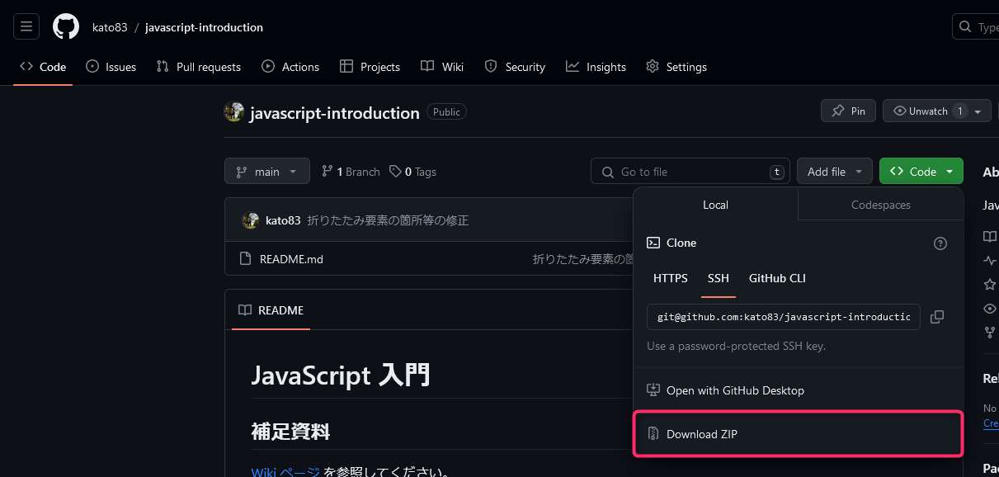

# JavaScript 入門

## 講座補足資料

**[Wiki ページ](https://github.com/kato83/javascript-introduction/wiki) を参照してください。**

## 開発環境構築

### Node.js のインストール

Windows PowerShell に以下コマンドを入力して Node.js をインストールしてください。

> [!TIP]
> `node -v` コマンドを叩いて **v18以降かつ長期サポート (LTS)** のNode.jsがPC上で動作するようにします。  
> 既にインストールされている場合は作業をスキップして問題ありません。  
> 2024-01-27時点でv18未満のバージョンが入っている場合はサポートが切れているので再インストールを実施してください。

```
> winget install "Node.js LTS"
```

<details>
<summary>実行後に標準出力される内容一例</summary>

```
> winget install "Node.js LTS"
見つかりました Node.js LTS [OpenJS.NodeJS.LTS] バージョン 20.10.0
このアプリケーションは所有者からライセンス供与されます。
Microsoft はサードパーティのパッケージに対して責任を負わず、ライセンスも付与しません。
ダウンロード中 https://nodejs.org/dist/v20.10.0/node-v20.10.0-x64.msi
  ██████████████████████████████  25.3 MB / 25.3 MB
インストーラーハッシュが正常に検証されました
パッケージのインストールを開始しています...
インストールが完了しました
```

</details>

**Windows PowerShell のウィンドウを閉じ、再度開いたうえ** で以下コマンドでエラーが出ていないことを確認してください。

```
> node -v
```

<details>
<summary>実行後に標準出力される内容一例</summary>

```
> node -v
v20.10.0
```

</details>

## Microsoft Visual Studio Code のインストール

> [!TIP]
> `code -v` コマンドを叩いてバージョン情報が返ってきたらインストール済みなので作業をスキップして問題ありません。

Windows PowerShell に以下コマンドを入力して Node.js をインストールしてください。

```
> winget install -q vscode --scope machine
```

<details>
<summary>実行後に標準出力される内容一例</summary>

```
> winget install -q vscode
既存のパッケージが既にインストールされています。インストールされているパッケージ...をアップグレードしようとしています
利用可能なアップグレードが見つかりませんでした。
構成されたソースから入手できる新しいパッケージ バージョンはありません。
```

</details>

### Google Chrome のインストール

入っていると思いますが [Google Chrome - Google の高速で安全なブラウザをダウンロード](https://www.google.com/intl/ja_jp/chrome/) からダウンロード及びインストールが可能です。

### 開発資材のダウンロード

以下画像を参考にZIPファイルをダウンロードしてください。



ダウンロードしたZIPファイルは任意の場所に解凍してください。  
解凍したファイルが今後授業でプログラミングを実施する作業フォルダになります。
